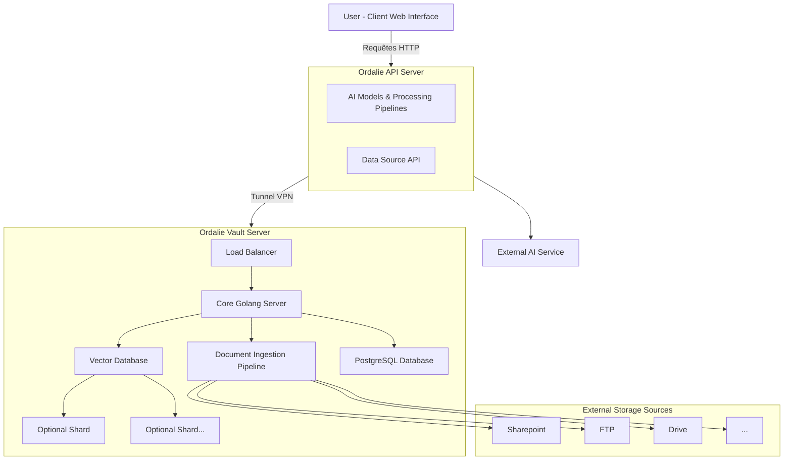

# 1. Préambule

[*Vidéo d’introduction de la fondatrice - présentant Ordalie et ses fonctionnalités en gros.*]()

Ordalie est une des premières IA génératives juridiques françaises qui a vu le jour le 1er Mai 2023.

Notre mission : …

# 2. Sources

## Sources d'Ordalie 📚

## Vos sources 🔒

### Internet

### Documents utilisateur

# 3. Ordalie Vault

> **Ordalie Vault** est une offre disponible sur demande. Pour plus d'informations ou pour souscrire à cette solution, veuillez contacter notre équipe à l'adresse suivante : support@ordalie.com.

**Vault** est un module installable **on-premise** 🏢, spécialement conçu pour les entreprises souhaitant maximiser l'intégration d'Ordalie avec leur système d'information (SI). En installant ce module directement dans leur environnement, Ordalie se connecte aux différentes sources de données internes de l'entreprise.

### Une solution sur-mesure pour valoriser le knowledge interne

Cette solution personnalisée décuple les capacités d'Ordalie et permet une valorisation optimale des connaissances internes. Avec Ordalie Vault, l'entreprise accède rapidement aux documents pertinents lors des recherches : mémos juridiques, dossiers clients, archives de jurisprudence interne, et bien plus encore.

En plus de cela, Ordalie Vault facilite :

- La **recherche de documents** internes 📂,
- La **suggestion de clauses** adaptées aux besoins spécifiques 📑,
- La **génération de documents** à partir de templates internes 📝, rendant chaque processus de création plus fluide et cohérent.

Ordalie Vault s'intègre naturellement dans les flux de travail, transformant chaque recherche et chaque création documentaire en une expérience optimisée et adaptée aux besoins uniques de l'entreprise.

## A. Comment l'utiliser ?

### 🔍 Recherche de documents

Ordalie facilite la recherche de documents en utilisant l'IA pour sélectionner automatiquement les fichiers les plus pertinents en fonction de votre requête.

- **Recherche générale** : Par défaut, l'IA choisit les documents qu'elle juge utiles pour répondre à votre besoin.
- **Recherche ciblée dans le vault** : Si vous souhaitez limiter la recherche aux documents internes, vous pouvez le faire explicitement en lui demandant de chercher dans le "vault". Cela restreint les résultats aux données internes de votre entreprise.
- **Onglet "/search"** : Accessible via l'icône de loupe, cet onglet permet de retrouver tous les documents du vault correspondant à une requête spécifique.

[videos de démonstration intégrées]()

### 📁 Navigation dans le vault

Naviguer dans le vault est simple et intuitif. Dans chaque champ d'Ordalie, vous pouvez utiliser le symbole **"@"** pour mentionner des sources internes spécifiques liées à votre compte.

1. **Accéder aux sources** : Une fois connecté au vault, le nom de votre entreprise s'affiche dans la liste des sources disponibles.
2. **Navigation dans les dossiers** : Utilisez les flèches pour parcourir les dossiers et sélectionnez celui qui vous intéresse en appuyant sur **Enter** ou en cliquant dessus.
3. **Analyse de dossiers** : Si vous sélectionnez un dossier, Ordalie analysera tous les documents qu’il contient, en profondeur, pour enrichir vos requêtes.

La commande **"@"** est utilisable dans le chat, ainsi que dans d'autres menus comme **"Générer avec l'IA"** et dans vos **presets d'analyses**. Cette fonctionnalité vous permet d'accéder facilement et rapidement aux connaissances internes de votre entreprise, optimisant ainsi chaque interaction avec Ordalie.

## B. Comment ça marche ?

# 4. Assistant

## Actions possibles

## Conseils d'utilisation

## Historique

# 5. Documents

## Importez vos documents

### Import

### Organisation

## Génération de documents

# 6. Autres fonctionnalités

## Notes

## Recherche simple

# 7. Gérez votre compte

## Factures

## Modifiez votre abonnement

# 8. Support
