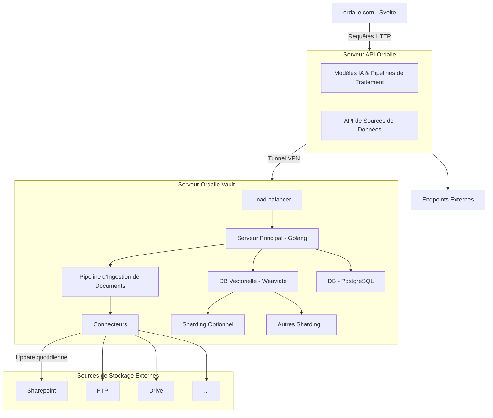

# Bienvenue sur Ordalie

[*Vidéo d’introduction de la fondatrice - présentant Ordalie et ses fonctionnalités en gros.*]()

Ordalie est une des premières IA génératives juridiques françaises qui a vu le jour le 1er Mai 2023.

Notre mission : …

# Sources

## Sources d'Ordalie 📚

### Open Data

Ordalie intègre des sources de données publiques provenant de la France et de l'Europe, couvrant une grande variété de textes de lois, règlements, et jurisprudences :

- **France** 🇫🇷 :
    - Tous les codes et lois, ainsi que les ordonnances officielles, sont consultables.
    - Jurisprudence variée incluant les décisions de la Cour de cassation, des cours d’appel, des cours administratives d’appel, du Conseil d’État, et de certains tribunaux de première instance publiés dans des recueils publics.
    - Autres ressources, comme le Bulletin officiel des finances publiques (BOFiP).

- **Europe** 🇪🇺 :
    - Les règlements et directives européens sont entièrement intégrés via **EUR-Lex**, offrant ainsi une vue complète de la réglementation applicable au sein de l’Union Européenne.
    - Jurisprudences importantes de la Cour de Justice de l'Union Européenne (CJUE) et du Tribunal de l'Union Européenne (TUE).

Ces sources publiques garantissent que les utilisateurs d’Ordalie ont accès à l’ensemble des documents de référence pertinents pour leurs recherches juridiques, couvrant ainsi les besoins en droit national et européen.

## Vos sources 🔒

Ordalie vous permet d'intégrer vos propres sources de données, pour une recherche enrichie et totalement personnalisée, tout en garantissant une confidentialité absolue. Vos sources restent strictement privées et **ne sont jamais partagées** avec d'autres utilisateurs. Vous avez deux options principales pour ajouter vos propres données :

### 🌐 Internet

Ordalie peut indexer des **sites internet de votre choix** pour enrichir vos recherches.

> Nous avons choisi de ne pas indexer les résultats *Google* car il est difficile de garantir la fraîcheur de leurs informations. Cependant, nous vous laissons la responsabilité de choisir les sites auxquels vous faites confiance.

Vous sélectionnez les sites spécifiques qui vous intéressent, et Ordalie se charge de les parcourir et d’indexer les informations qu’ils contiennent. Cela permet d'intégrer ces contenus aux réponses générées lors de vos recherches, offrant ainsi des résultats encore plus pertinents et complets.

### 📄 Documents utilisateur

Ordalie vous permet également d'importer vos propres documents grâce au bouton **"Ajouter aux sources"**. Que ce soit des mémos, des décisions de jurisprudence, ou des analyses internes, vos documents ajoutés deviennent directement intégrés dans la base de connaissances d’Ordalie et appuient les résultats de vos recherches.

> **Confidentialité** 🔒 : Tous les documents importés restent strictement privés. Ils sont protégés et ne sont jamais partagés ni accessibles par d’autres utilisateurs. La sécurité de vos données est une priorité, assurant que seul votre compte ou votre organisation peut y accéder.

En utilisant vos propres sources, vous transformez Ordalie en un outil sur-mesure, parfaitement adapté à vos besoins, tout en gardant un contrôle total sur la sécurité de vos informations.

# Ordalie Vault

**Vault** est un module installable **on-premise** 🏢, spécialement conçu pour les entreprises souhaitant maximiser l'intégration d'Ordalie avec leur système d'information (SI). En installant ce module directement dans leur environnement, Ordalie se connecte aux différentes sources de données internes de l'entreprise.

> **Ordalie Vault** est une offre disponible sur demande. Pour plus d'informations ou pour souscrire à cette solution, veuillez contacter notre équipe à l'adresse suivante : support@ordalie.com.

### Une solution sur-mesure pour valoriser le knowledge interne

Cette solution personnalisée décuple les capacités d'Ordalie et permet une valorisation optimale des connaissances internes. Avec Ordalie Vault, l'entreprise accède rapidement aux documents pertinents lors des recherches : mémos juridiques, dossiers clients, archives de jurisprudence interne, et bien plus encore.

En plus de cela, Ordalie Vault facilite :

- La **recherche de documents** internes 📂,
- La **suggestion de clauses** adaptées aux besoins spécifiques 📑,
- La **génération de documents** à partir de templates internes 📝, rendant chaque processus de création plus fluide et cohérent.

Ordalie Vault s'intègre naturellement dans les flux de travail, transformant chaque recherche et chaque création documentaire en une expérience optimisée et adaptée aux besoins uniques de l'entreprise.

## Comment l'utiliser ?

### 🔍 Recherche de documents

Ordalie facilite la recherche de documents en utilisant l'IA pour sélectionner automatiquement les fichiers les plus pertinents en fonction de votre requête.

- **Recherche générale** : Par défaut, l'IA choisit les documents qu'elle juge utiles pour répondre à votre besoin.
- **Recherche ciblée dans le vault** : Si vous souhaitez limiter la recherche aux documents internes, vous pouvez le faire explicitement en lui demandant de chercher dans le "vault". Cela restreint les résultats aux données internes de votre entreprise.
- **Onglet "/search"** : Accessible via l'icône de loupe, cet onglet permet de retrouver tous les documents du vault correspondant à une requête spécifique.

<video-embed src="https://customer-xa6r67fpbzwss0sd.cloudflarestream.com/e6e41d96f30bda15e084ef3c62f2d76c/iframe?poster=https%3A%2F%2Fcustomer-xa6r67fpbzwss0sd.cloudflarestream.com%2Fe6e41d96f30bda15e084ef3c62f2d76c%2Fthumbnails%2Fthumbnail.jpg%3Ftime%3D%26height%3D600"></video-embed>

### 📁 Navigation dans le vault

Naviguer dans le vault est simple et intuitif. Dans chaque champ d'Ordalie, vous pouvez utiliser le symbole **"@"** pour mentionner des sources internes spécifiques liées à votre compte.

1. **Accéder aux sources** : Une fois connecté au vault, le nom de votre entreprise s'affiche dans la liste des sources disponibles.
2. **Navigation dans les dossiers** : Utilisez les flèches pour parcourir les dossiers et sélectionnez celui qui vous intéresse en appuyant sur **Enter** ou en cliquant dessus.
3. **Analyse de dossiers** : Si vous sélectionnez un dossier, Ordalie analysera tous les documents qu’il contient, en profondeur, pour enrichir vos requêtes.

La commande **"@"** est utilisable dans le chat, ainsi que dans d'autres menus comme **"Générer avec l'IA"** et dans vos **presets d'analyses**. Cette fonctionnalité vous permet d'accéder facilement et rapidement aux connaissances internes de votre entreprise, optimisant ainsi chaque interaction avec Ordalie.

## Comment ça marche ?

Ordalie est structuré pour s'intégrer harmonieusement avec les systèmes d'information de ses utilisateurs, offrant ainsi une expérience enrichie et optimisée grâce à Ordalie Vault. Voici un aperçu du flux de données et du fonctionnement des différents composants :

### 1. Utilisateur et Interface

L'utilisateur interagit avec **Ordalie** via l'interface habituelle sur **ordalie.com**.

### 2. Serveur API d'Ordalie

Le **Serveur API d'Ordalie** est le cœur du système, centralisant toutes les requêtes de l'utilisateur et faisant le lien avec le Vault de manière exclusive et sécurisée.

### 3. Connexion au Serveur Ordalie Vault via un Tunnel VPN sécurisé

Pour accéder aux données internes de l'entreprise, le Serveur API d'Ordalie établit une connexion sécurisée via un tunnel VPN avec le **Serveur Ordalie Vault**. Ce dernier n'est pas une simple interface d'accès mais un module complet et autonome, conçu pour fonctionner en on-premise chez le client, tout en se synchronisant avec Ordalie pour les mises à jour et les évolutions de fonctionnalités.

### 4. Serveur Ordalie Vault

Le **Serveur Ordalie Vault** permet une intégration en profondeur avec les systèmes internes de l'entreprise, tout en offrant une infrastructure puissante et flexible :

- **Équilibreur de Charge (Load Balancer)** : Distribue les requêtes efficacement pour optimiser la performance et la réactivité.
- **Serveur Principal (Golang)** : Au cœur de ce serveur, le Serveur Principal gère les requêtes locales et orchestre les différentes étapes de traitement des données.
- **Pipeline d'Ingestion de Documents** : Ce pipeline permet l'intégration automatique des documents internes de l'entreprise, en récupérant les fichiers depuis les différentes sources de stockage grâce aux connecteurs.

### 5. Intégration des Sources de Données Externes

Le **Pipeline d'Ingestion de Documents** du Serveur Vault s'appuie sur des **Connecteurs** pour se connecter aux sources de données externes de l'entreprise, telles que :

- **Sharepoint**
- **FTP**
- **Google Drive**
- Et **toute autre source** disposant d'un accès API ou d'un protocole de transfert de fichiers...

Les connecteurs se mettent à jour quotidiennement, assurant que les informations disponibles dans Ordalie sont toujours récentes.

### 6. Gestion et Optimisation des Données dans le Vault

Une fois les documents intégrés, le Serveur Vault les organise dans deux bases de données :

- **DB Vectorielle (Weaviate)** : Permet une recherche avancée et une organisation optimisée des documents par similarité de contenu. La base vectorielle peut également être partitionnée en **sharding** pour gérer les volumes de données importants de manière efficace.
- **DB SQL (PostgreSQL)** : Utilisée pour la gestion des données structurées et des métadonnées, assurant une robustesse et une fiabilité dans le stockage et l'accès aux informations.

Ce système modulaire permet à Ordalie Vault de s'intégrer directement dans l'écosystème de l'entreprise, tout en bénéficiant des évolutions d'Ordalie pour rester toujours à jour.

# Assistant

## Actions possibles

## Conseils d'utilisation

## Historique

# Documents

## Importez vos documents

### Import

### Organisation

## Génération de documents

# Autres fonctionnalités

## Notes

## Recherche simple

# Gérez votre compte

## Factures

## Modifiez votre abonnement

# Support
