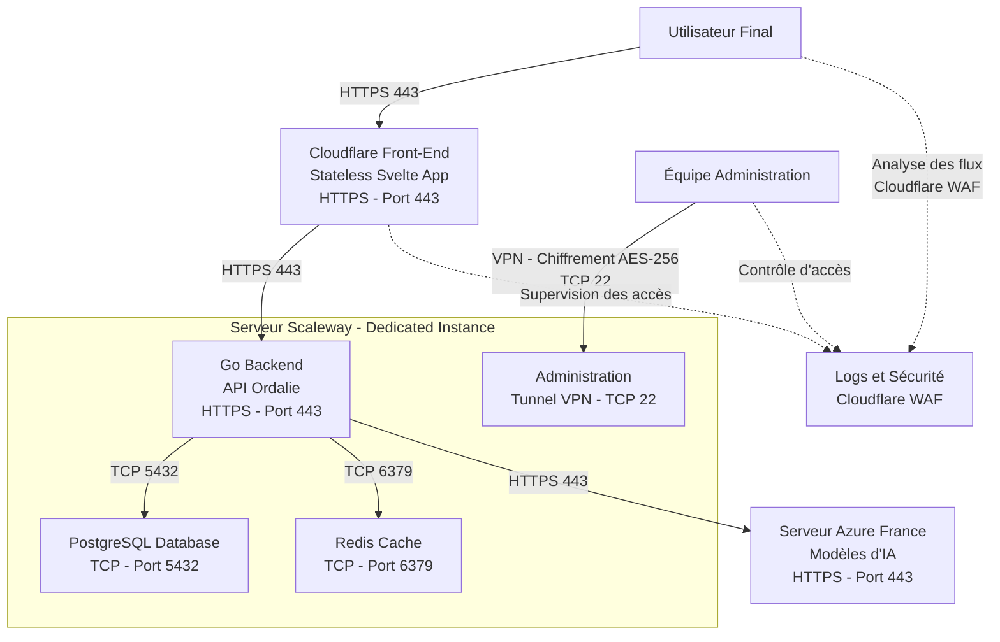

### Schéma d'architecture technique

```mermaid
graph TD

%% Utilisateur et Front-End

A[Utilisateur Final]

B[Cloudflare Front-End<br>Stateless Svelte App<br>HTTPS - Port 443]

G[Logs et Sécurité<br>Cloudflare WAF]

  

%% Groupe Scaleway

subgraph Scaleway [Serveur Scaleway - Dedicated Instance]

C[Go Backend<br>API Ordalie<br>HTTPS - Port 443]

D[PostgreSQL Database<br>TCP - Port 5432]

E[Redis Cache<br>TCP - Port 6379]

H[Administration<br>Tunnel VPN - TCP 22]

end

  

%% Azure France

F[Serveur Azure France<br>Modèles d'IA<br>HTTPS - Port 443]

  

%% Administration

Z[Équipe Administration]

  

%% Flux utilisateurs

A -->|HTTPS 443| B

B -->|HTTPS 443| C

  

%% Flux internes Scaleway

C -->|TCP 5432| D

C -->|TCP 6379| E

  

%% Flux sortant Azure

C -->|HTTPS 443| F

  

%% Administration sécurisée

Z -->|VPN - Chiffrement AES-256 <br>TCP 22| H

  

%% Sécurité

A -.->|Analyse des flux<br>Cloudflare WAF| G

B -.->|Supervision des accès| G

Z -.->|Contrôle d'accès| G
```
